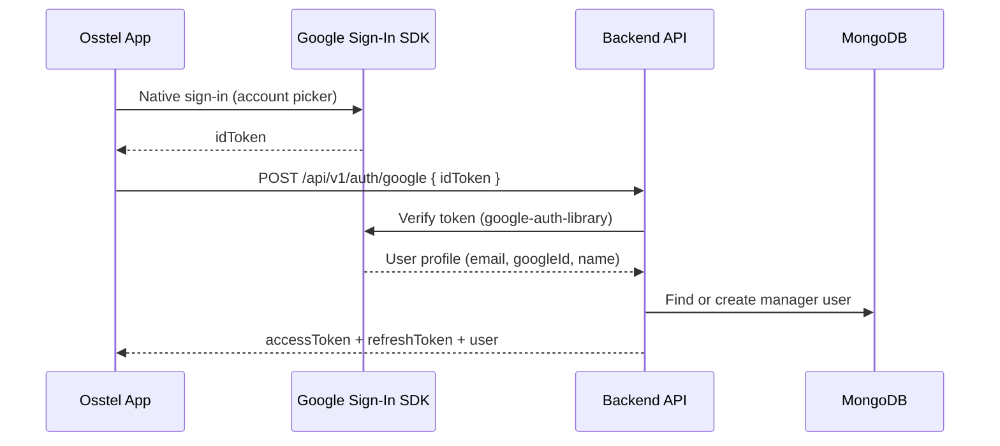

# Google Sign-In Setup Guide (Osstel)

This guide documents the full Google Sign-In configuration for Osstel. It covers Google Cloud Console, Firebase, the mobile app (`osstel`), and the backend (`osstel-backend`).

Google Sign-In is **manager-only**. Residents continue to sign in with **User ID + password**.

---

## How it works



**Important:** Osstel uses **native Google Sign-In** (`@react-native-google-signin/google-signin`). It does **not** open a browser OAuth flow, so you do **not** need to add custom redirect URIs like `osstel://oauthredirect` to the **Web** OAuth client.

---

## Prerequisites

- Google account with access to [Google Cloud Console](https://console.cloud.google.com/)
- Firebase project linked to the same Google Cloud project
- App package name: `com.fa11ad.osstel`
- Backend deployed (e.g. Vercel): `https://osstel-backend.vercel.app`

---

## Step 1: Google Cloud project

1. Open [Google Cloud Console](https://console.cloud.google.com/).
2. Select your project (or create one, e.g. `osstel`).
3. Go to **APIs & Services → OAuth consent screen**.
4. Configure:
   - **User type:** External (for public app) or Internal (workspace only)
   - **App name:** Osstel
   - **Support email:** your email
   - **Scopes:** `email`, `profile`, `openid` (default basic scopes are enough)
5. While in **Testing** mode, add your Google account(s) under **Test users**.
6. When ready for production, click **Publish app**.

---

## Step 2: Create OAuth 2.0 clients

Go to **APIs & Services → Credentials → Create Credentials → OAuth client ID**.

You need **three** clients:

### 2.1 Web client (required)

| Field | Value |
|-------|-------|
| Application type | Web application |
| Name | Osstel Web (or similar) |

**Authorized redirect URIs:** leave default / only add `https://` URIs if you use web OAuth elsewhere. Do **not** add `osstel://` here — Web clients reject custom URL schemes.

Copy the **Client ID** → used as:
- `EXPO_PUBLIC_GOOGLE_WEB_CLIENT_ID` in the app
- First value in backend `GOOGLE_CLIENT_IDS`

Example format:
```
241724680878-xxxxxxxx.apps.googleusercontent.com
```

### 2.2 Android client (required)

| Field | Value |
|-------|-------|
| Application type | Android |
| Package name | `com.fa11ad.osstel` |
| SHA-1 certificate fingerprint | Your debug (and later release) SHA-1 |

**Get debug SHA-1:**

```bash
keytool -list -v \
  -keystore ~/.android/debug.keystore \
  -alias androiddebugkey \
  -storepass android \
  -keypass android
```

Copy **SHA-1** and **SHA-256** from the output.

For production (Play Store), also add the **release** keystore SHA-1 and SHA-256.

Copy the **Client ID** → `EXPO_PUBLIC_GOOGLE_ANDROID_CLIENT_ID` and include in backend `GOOGLE_CLIENT_IDS`.

### 2.3 iOS client (required for iOS builds)

| Field | Value |
|-------|-------|
| Application type | iOS |
| Bundle ID | `com.fa11ad.osstel` |

Copy the **Client ID** → `EXPO_PUBLIC_GOOGLE_IOS_CLIENT_ID` and include in backend `GOOGLE_CLIENT_IDS`.

**iOS URL scheme** (for the Expo plugin) is derived from the iOS client ID:

```
com.googleusercontent.apps.<CLIENT_ID_PREFIX>
```

Example: if iOS client ID is `241724680878-1jam9dkhl0f59jckdmgv54ppdepfdfbo.apps.googleusercontent.com`, the scheme is:

```
com.googleusercontent.apps.241724680878-1jam9dkhl0f59jckdmgv54ppdepfdfbo
```

---

## Step 3: Firebase setup

Firebase and Google Cloud share the same project when linked correctly.

1. Open [Firebase Console](https://console.firebase.google.com/).
2. Select your project.
3. Go to **Project settings → Your apps**.

### Android app

1. Add Android app with package `com.fa11ad.osstel`.
2. Add **SHA-1** and **SHA-256** (same as Google Cloud Android client).
3. Download `google-services.json`.
4. Place it in the app root: `osstel/google-services.json`.

### iOS app

1. Add iOS app with bundle ID `com.fa11ad.osstel`.
2. Download `GoogleService-Info.plist`.
3. Place it in the app root: `osstel/GoogleService-Info.plist`.

### Enable Google sign-in in Firebase (optional but recommended)

1. **Authentication → Sign-in method → Google → Enable**.
2. This keeps Firebase Auth in sync; the app uses native SDK + backend token verification.

---

## Step 4: Mobile app configuration (`osstel`)

### 4.1 Install dependency

```bash
npx expo install @react-native-google-signin/google-signin
```

### 4.2 Environment variables (`.env`)

```env
EXPO_PUBLIC_GOOGLE_WEB_CLIENT_ID=your-web-client-id.apps.googleusercontent.com
EXPO_PUBLIC_GOOGLE_ANDROID_CLIENT_ID=your-android-client-id.apps.googleusercontent.com
EXPO_PUBLIC_GOOGLE_IOS_CLIENT_ID=your-ios-client-id.apps.googleusercontent.com
```

The **Web client ID is required** for native sign-in on Android (it is passed as `webClientId` to the SDK so Google returns an `idToken`).

### 4.3 `app.json` plugin

The Google Sign-In Expo plugin adds the iOS URL scheme:

```json
[
  "@react-native-google-signin/google-signin",
  {
    "iosUrlScheme": "com.googleusercontent.apps.YOUR_IOS_CLIENT_PREFIX"
  }
]
```

Also ensure:

```json
{
  "expo": {
    "scheme": "osstel",
    "ios": {
      "bundleIdentifier": "com.fa11ad.osstel",
      "googleServicesFile": "./GoogleService-Info.plist"
    },
    "android": {
      "package": "com.fa11ad.osstel",
      "googleServicesFile": "./google-services.json"
    }
  }
}
```

### 4.4 Key app files

| File | Purpose |
|------|---------|
| `src/config/googleAuth.ts` | Reads env client IDs |
| `src/hooks/useGoogleSignIn.ts` | Native Google Sign-In, returns `idToken` |
| `src/app/auth/signin.tsx` | "Continue with Google" button (managers only) |
| `store/api.ts` | `POST /auth/google` mutation |

### 4.5 Rebuild native app

After changing plugins, `app.json`, or `google-services.json`:

```bash
npx expo prebuild --platform android --clean
npx expo run:android
```

For iOS:

```bash
npx expo prebuild --platform ios --clean
npx expo run:ios
```

A normal Metro reload is **not** enough after native config changes.

---

## Step 5: Backend configuration (`osstel-backend`)

### 5.1 Environment variable

On Vercel (or `.env` locally), set:

```env
GOOGLE_CLIENT_IDS=web-client-id,android-client-id,ios-client-id
```

All three client IDs, comma-separated, no spaces (or trim spaces — the server trims them).

### 5.2 API endpoint

```
POST /api/v1/auth/google
Content-Type: application/json

{
  "idToken": "<token from Google Sign-In SDK>"
}
```

**Success response:** `accessToken`, `refreshToken`, and `user` (same shape as login).

**Backend behavior:**
- Verifies `idToken` with `google-auth-library`
- **Managers only** — residents get `403`
- Creates a new manager if no account exists
- Links existing manager by email if found
- Blocks users with `status: blocked`

### 5.3 Key backend files

| File | Purpose |
|------|---------|
| `src/routes/authRoutes.js` | `POST /google` route |
| `src/controllers/authController.js` | `googleAuth` handler |
| `src/services/googleAuthService.js` | Token verification |
| `package.json` | `google-auth-library` dependency |

### 5.4 Deploy backend

After pushing Google auth code, redeploy on Vercel from the latest `main` commit.

Verify the route exists:

```bash
curl -X POST https://osstel-backend.vercel.app/api/v1/auth/google \
  -H "Content-Type: application/json" \
  -d '{"idToken":"test"}'
```

- **404** → old deployment; redeploy latest `main`
- **401** → route works; token invalid (expected for `"test"`)

---

## Step 6: Security checklist

- [ ] Do **not** commit `client_secret_*.json` (server OAuth secret — not needed for mobile native sign-in)
- [ ] Do **not** commit `.env` with real secrets
- [ ] Keep `google-services.json` and `GoogleService-Info.plist` out of public repos if possible (or restrict API keys in Google Cloud)
- [ ] Add **release** SHA-1/SHA-256 before Play Store release
- [ ] Publish OAuth consent screen before public launch
- [ ] Backend `GOOGLE_CLIENT_IDS` must include all client IDs that can issue tokens

---

## Redirect URI FAQ

| Question | Answer |
|----------|--------|
| What is a redirect URI? | Where Google sends the user after browser OAuth. Used by web/browser flows. |
| Do I need `osstel://oauthredirect`? | **No** for native sign-in. |
| Why did Google reject `osstel://` on Web client? | Web OAuth clients only allow `https://` redirect URIs. |
| What does Android use instead? | Package name + SHA-1 on the **Android** OAuth client. |
| What does iOS use? | Bundle ID + reversed client ID URL scheme in `app.json`. |

---

## Troubleshooting

### `Access blocked: invalid_request` (browser / accounts.google.com)

You are using browser OAuth instead of native sign-in. Ensure:
- `@react-native-google-signin/google-signin` is installed
- App was rebuilt with `expo prebuild` + `expo run:android`
- `useGoogleSignIn.ts` uses `GoogleSignin.signIn()`, not `expo-auth-session`

### `DEVELOPER_ERROR` on Android

- Wrong package name (must be `com.fa11ad.osstel`)
- SHA-1 not added to Google Cloud **Android** client
- SHA-1 mismatch — run `keytool` on the keystore you actually build with
- `webClientId` is not the **Web** client ID

### `Route /api/v1/auth/google not found`

- Backend not deployed with latest code
- Redeploy Vercel from latest `main` commit

### `GOOGLE_CLIENT_IDS is not configured on the server`

- Set `GOOGLE_CLIENT_IDS` on Vercel and redeploy

### `Invalid Google token` / `401`

- Client ID used to sign in is not in `GOOGLE_CLIENT_IDS`
- Token expired — sign in again
- Wrong `webClientId` in app config

### Google button not showing

- `EXPO_PUBLIC_GOOGLE_WEB_CLIENT_ID` missing from `.env`
- Restart Expo after changing `.env`
- Button only shows for **Manager** role on sign-in screen

### Sign-in works in debug but not release

- Add **release** keystore SHA-1 and SHA-256 to Google Cloud and Firebase
- Use the same package name `com.fa11ad.osstel`

---

## Quick reference

| Item | Value |
|------|-------|
| Package / Bundle ID | `com.fa11ad.osstel` |
| App scheme | `osstel` (deep links — not used for Google OAuth) |
| Sign-in library | `@react-native-google-signin/google-signin` |
| Backend endpoint | `POST /api/v1/auth/google` |
| App env (required) | `EXPO_PUBLIC_GOOGLE_WEB_CLIENT_ID` |
| Backend env (required) | `GOOGLE_CLIENT_IDS` (all 3 IDs, comma-separated) |
| Who can use it | Managers only |

---

## Related files

**App (`osstel`):**
- `docs/GOOGLE_SIGN_IN.md` (this file)
- `src/hooks/useGoogleSignIn.ts`
- `src/config/googleAuth.ts`
- `app.json`
- `.env`
- `google-services.json` (Android, not in git)
- `GoogleService-Info.plist` (iOS, not in git)

**Backend (`osstel-backend`):**
- `src/routes/authRoutes.js`
- `src/controllers/authController.js`
- `src/services/googleAuthService.js`
